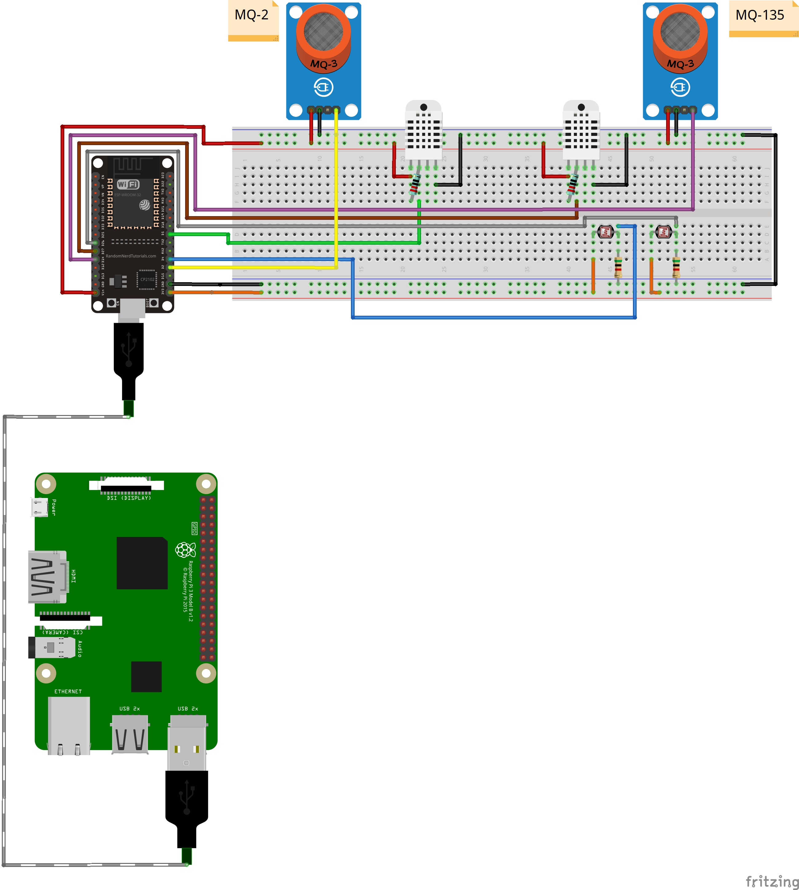

# Miseri
El objetivo principal de este proyecto es desarrollar un dispositivo versátil y eficiente, que brinde información valiosa sobre su entorno.

# Miseri Services
**Miseri Services** es un monorepo donde se aloja el código fuente que controla el hardware, lector de dato y el servidor que gestiona, analiza y sirven los datos de la aplicación.

**Lenguajes**: Python, Arduino.

**Controladores**: ESP-WROOM-32, Raspberry Pi 4 Model B.

**Sensores**: MQ-2, DHT11, Fotoresistor.

## Relaciones
Este monorepo, como su nombre lo indica, almacena el código fuente de todas las partes del proyecto, es importante que cada controlador tenga su código correcto para el buen funcionamiento.

A continuación, una tabla con la relación componente-carpeta:

| Componente               | Carpeta   |
| ------------------------ | --------- |
| ESP-WROOOM-32            | `esp32/`  |
| Raspberry Pi 4 Model B   | `rasp/`   |
| EC2 / Alojamiento remoto | `server/` |

## Diagrama

